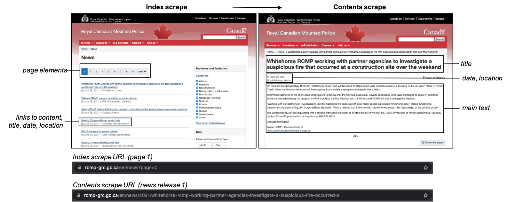
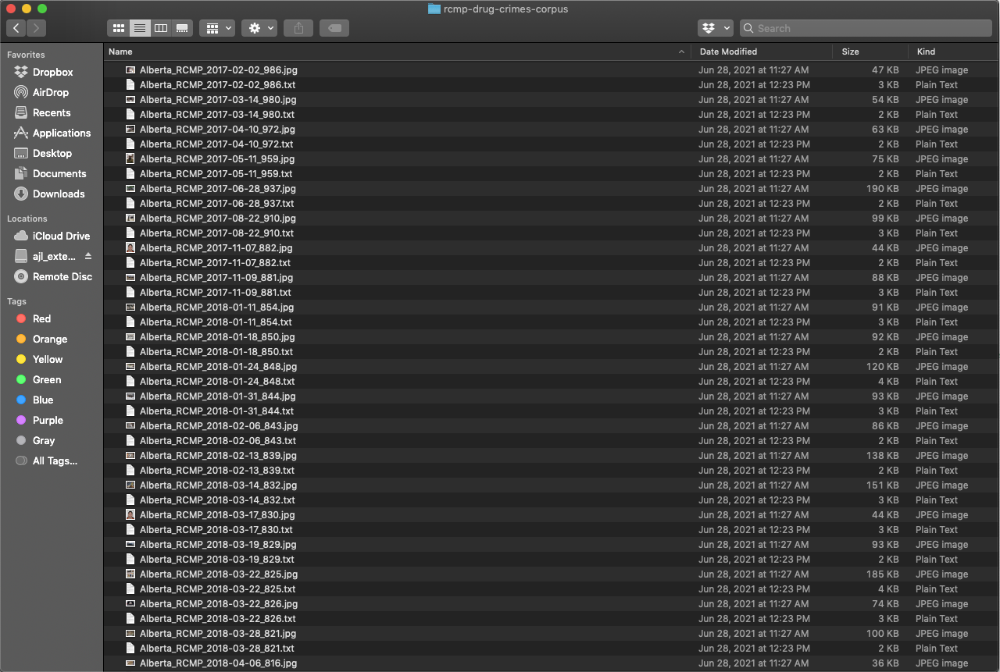
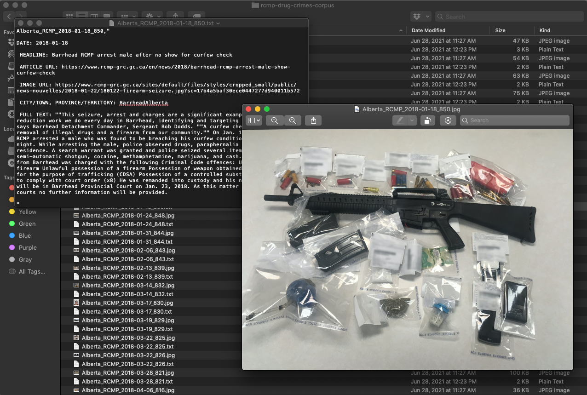
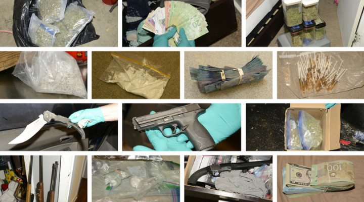
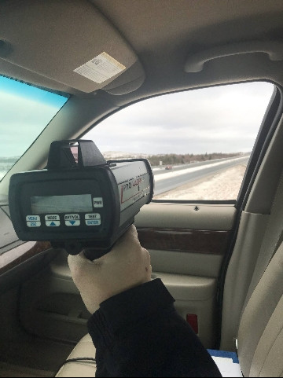

# Introduction

To reproduce the code in this supplement, readers will need at least *some* background in the [R](https://www.r-project.org/) programming language. There are many excellent resources available to learn the basics of R (and the [RStudio](https://www.rstudio.com/) integrated development environment or IDE, which we recommend). While certainly not an exhaustive list, below are some of our favourite *free* resources for learning the R/RStudio essentials you'll need to follow along with this supplement.

- Rohan Alexander's [*Telling Stories with Data*](https://www.tellingstorieswithdata.com/index.html). For first time R/RStudio users, see in particular chapter 3, ["R Essentials"](https://www.tellingstorieswithdata.com/r-essentials.html).
- Hadley Wickham and Garrett Grolemund's [*R for Data Science*](https://r4ds.had.co.nz/).
- Jared Knowles's [*R Bootcamp*](https://www.jaredknowles.com/r-bootcamp/).
- Jennifer Bryan and Jim Hester's [*What They Forgot to Teach You About R*](https://rstats.wtf/index.html).

Although not always free, there are also many courses available online through websites like [Codecademy](https://www.codecademy.com/learn/learn-r), [Coursera](https://www.coursera.org/learn/r-programming), [edX](https://www.edx.org/learn/r-programming), [udemy](https://www.udemy.com/course/r-basics/), and [DataCamp](https://www.datacamp.com/courses/free-introduction-to-r).

# A Framework for Using Computational Methods in Qualitative Research

The rest of this supplement follows the six stages of the framework for using computational methods in qualitative research developed in the article. These stages are: (1) defining the problem; (2) collecting; (3) parsing, exploring, and cleaning; (4) sampling and outputting; (5) analyzing; and (6) findings and discussion. The bulk of material in this supplement is focused on steps 2, 3, and 4, as these are the steps that involved R programming. More in-depth discussions of the remaining steps 1, 5, and 6 can be found in the article.

## Step 1: Defining the Problem

The first step in designing a project that incorporates computational methods – as with any research project – is to determine a research question. For the sake of brevity, here we only restate the two overarching research questions that guided our collection and analysis of RCMP news releases. We asked: 

> How do the Royal Canadian Mounted Police (RCMP) visually represent their policing work in Canada? More specifically, what ‘work’ do the images included in RCMP press releases do with respect to conveying a message about policing and social control? 

## Step 2: Collecting

All data for this study were collected via web scraping. The first major step in conducting a web scrape is page exploration/inspection. What the researcher does at this stage is explore the content and structure of the pages they are interested in. The goal is to, first, find the various page elements that one wishes to collect. In this case, as we explain in the article, we are interested in collecting specific data points from thousands of RCMP news releases, including the title of each news release, date, location of RCMP detachment, the main text of the news release, and links to any images contained in the news release.

The second goal is to come up with an [algorithmic solution](https://link-springer-com.myaccess.library.utoronto.ca/article/10.1007/s11135-021-01164-0) or strategy for collecting this information. A key part of this second step is to carefully examine the source code of the website to determine what tools or libraries will be necessary to execute the scrape. While simpler websites can be scraped using an R package like [library(rvest)](https://cran.r-project.org/web/packages/rvest/index.html), more sophisticated websites may require that the researcher use an additional set of tools such as [library(RSelenium)](https://cran.r-project.org/web/packages/RSelenium/index.html).

It is also important during exploration/inspection to consider the legal and ethical implications of the scrape, which includes reviewing the website's terms and conditions of use and 'robots exclusion protocol' or [robots.txt](https://en.wikipedia.org/wiki/Robots_exclusion_standard). A website's robots.txt directives can be obtained by adding /robots.txt to the root directory. The robots.txt for the RCMP's website is available [here](https://www.rcmp-grc.gc.ca/robots.txt). The legal and ethical dimensions of web scraping are discussed more fully in the article.

Another key part of constructing an algorithmic solution is to determine whether the information can (or should) be collected in one or multiple stages, where each stage represents a different script. We typically conduct our web scrapes in two stages: the index scrape and the contents scrape. 

The *index scrape* works by automatically “clicking” through the page elements containing links to each of sources one wants to obtain (in this case RCMP news articles), extracting link information for each individual source, as well other metadata that may be available. In this first scrape, the primary goal is to obtain each of these links, building an index. Next, we write and deploy the script for the *contents scrape* that visits each of the links in the index and obtains the desired data points.

The index and contents scrape can be thought of like a Google search. When searching the word “crime” on Google, one arrives first at a page containing various links to other websites. This first page (and subsequent pages) can be thought of as comprising the “index”: it contains the links to the pages we may be interested in visiting and consuming information from. Clicking on any given link in a Google result brings us to the website itself. The material on this website can be thought of as the contents, which would be obtained in the second (aka, contents) scrape. 



### Index Scrape

The first step we took in our index scrape was to write a file (specifically, a [comma-separated values](https://en.wikipedia.org/wiki/Comma-separated_values) or CSV file) to our local drive that we could use to store the results of our scrape. Another means of achieving the same result would be to store the results in RStudio's global environment, writing the results to your local drive after the scrape completes. Two downsides to this second approach are that you cannot view the results of the scrape until the scrape is completed, and if your scrape fails at some point (which it very likely will, especially on more time intensive tasks), you'll lose the results you had obtained up until that point.

So, using this first approach, we'll begin by creating a CSV spreadsheet that contains named columns for the data we'll be collecting in our index scrape (`headline_url`, `headline_text`, etc.). To do this, we'll use three tidyverse libraries: [library(tibble)](https://cran.r-project.org/web/packages/tibble/index.html), [library(readr)](https://cran.r-project.org/web/packages/readr/index.html), and [library(tidyr)](https://cran.r-project.org/web/packages/tidyr/index.html). (Remember that for this and subsequent steps, you'll need to install the libraries before loading them, unless you have them installed already. In RStudio, libraries only need to be installed once, but will need to be loaded each time you launch a new session.)

```{r message=FALSE, warning=FALSE}
#install.packages("tibble")
#install.packages("readr")
#install.packages("tidyr")
library(tibble)
library(readr)
library(tidyr)
```

```{r, eval=FALSE}
# give the file you'll be creating a name 
filename <- "rcmp-news-index-scrape.csv"

# using the tibble function, create a dataframe with column headers
create_data <- function(
    headline_url = NA,
    headline_text = NA,
    date_published = NA,
    metadata_text = NA,
    page_url = NA
  ) {
    tibble(
        headline_url = headline_url,
        headline_text = headline_text,
        date_published = date_published,
        metadata_text = metadata_text,
        page_url = page_url
    )
  }

# write tibble to csv
write_csv(create_data() %>% drop_na(), filename, append = TRUE, col_names = TRUE)
```

Next, we'll write the script for our index scraping algorithm, which will gather the data from the RCMP's website and populate the CSV file we created in the last chunk of code. (Assuming the last chunk of code ran successfully, you should have a CSV file titled `"rcmp-news-index-scrape.csv"` in your working directory.) To conduct our index scrape, we'll need to install/load an additional library -- [library(rvest)](https://cran.r-project.org/web/packages/rvest/index.html) -- that will be used to get and parse the information we want from the news release section of the RCMP's website. From library(rvest), we will be using six functions: `read_html()`, `html_node()`, `html_nodes()`, `html_attr()`, `html_text()`, and `url_absolute()`.

To locate the information we want, which is embedded in the RCMP website's [HyperText Markup Language or HTML code](https://en.wikipedia.org/wiki/HTML), we'll be specifying each of the HTML elements that contains each data point (`headline_url`, `headline_text`, `date_published`, `metadata_text`, and `page_url`). 

As we've written about [elsewhere](https://link-springer-com.myaccess.library.utoronto.ca/article/10.1007/s11135-021-01164-0), obtaining these elements is more an art than a science. There are [developer tools](https://developer.mozilla.org/en-US/docs/Learn/Common_questions/What_are_browser_developer_tools) built into every browser to help obtain them. Another popular tool is Andrew Cantino and Kyle Maxwell's incredibly efficient and user-friendly Chrome browser extension "[selector gadget](https://selectorgadget.com/)". 

It is vitally important when web scraping to always insert a pause into the code, typically a minimum of 3 seconds, which can be achieved using the base R function `Sys.sleep()`. Pausing the loop after each execution (since there are 13,637 URLs, it will be executed 13,637 times) prevents the web scrape from placing undue stress on a website server.

```{r message=FALSE, warning=FALSE}
#install.packages("rvest")
library(rvest)
```

```{r, eval=FALSE}
base_url <- 'https://www.rcmp-grc.gc.ca/en/news?page='

max_page_num <- NA # note that these pages are zero-indexed

scrape_page <- function(page_num = 0) {

  # grab html only once
  page_url <- paste(base_url, page_num, sep = '')

  curr_page <- read_html(page_url)

  # zero in on news list
  news_list <- curr_page %>%
    html_node('.list-group')

  # grab headline nodes
  headline_nodes <- news_list %>%
    html_nodes('div > div > a')

  # use headline nodes to get urls
  headline_url <- headline_nodes %>%
    html_attr('href') %>%
    url_absolute('https://www.rcmp-grc.gc.ca/en/news')

  # use headline nodes to get text
  headline_text <- headline_nodes %>%
    html_text(trim = TRUE)

  # grab metadata field
  metadata <- news_list %>%
    html_nodes('div > div > span.text-muted')

  # use metadata field to grab pubdate
  date_published <- metadata %>%
    html_nodes('meta[itemprop=datePublished]') %>%
    html_attr('content')

  # use metadata field to grab metadata text
  metadata_text <- metadata %>%
    html_text(trim = TRUE)

  # build a tibble
  page_data <- create_data(
    headline_url = headline_url,
    headline_text = headline_text,
    date_published = date_published,
    metadata_text = metadata_text,
    page_url = page_url
  )

  # write to csv
  write_csv(page_data, filename, append = TRUE)

  max_page <- curr_page %>%
    html_node('div.contextual-links-region ul.pagination li:nth-last-child(2)') %>%
    html_text(trim = TRUE) %>%
    as.numeric() %>%
    -(1)

  max_page_num <- max_page

  Sys.sleep(sample(seq(3, 10, by=1), 1))

  # recur
  if ((page_num + 1) <= max_page_num) {
    scrape_page(page_num = page_num + 1)
  }
  
  Sys.sleep(20) #20 second delay as per RCMP's robots.txt directives

}

# run it once
scrape_page()
```

Once our index scrape is complete, we can (must!) inspect the results before proceeding any further. To do this, we'll read our CSV file into R using the `read_csv()` function from library(readr). To print and inspect the results, we'll use the `paged_table()` function from [library(rmarkdown)](https://cran.r-project.org/web/packages/rmarkdown/index.html).

```{r}
#install.packages("rmarkdown")
library(rmarkdown)
```

```{r}
index <- read_csv("rcmp-news-index-scrape.csv")

paged_table(index)

nrow(index)
```

Using the contents of the `headline_url` column, which are the unique URLs for each of the 13,637 news releases published on the RCMP's website, we can conduct our contents scrape. What we'll be doing in the contents scrape is visiting each of the 13,367 links in the `headline_url` column and obtaining further information from each page, in particular the full text of the article and any images contained within it. 

To keep things simple, we are only going to take the first image from each page in the event that there are more than one image. ([Click here](https://www.rcmp-grc.gc.ca/en/news/2020/north-battleford-rcmp-execute-two-search-warrants-leading-significant-drugs-and-weapons) for an example of one of the pages we'll be scraping. You could also copy and paste any of the URLs in the `headline_url` column into your browser.)

### Contents Scrape

Like we did above, we'll begin by writing a CSV file to our local drive with named columns that correspond to the information we're going to collect. We're going to grab two data points from each of the links: the full text of the article (we'll name this variable `full_text` in the CSV file) and any images contained in the news release, if there are any (`image_url`). 

(Note that we are not grabbing the image itself at this point, but rather are scraping the URL for the image, which we will use in subsequent steps to download each image.) 

Additionally, we're going to save the page url (`headline_url`) for each article. Although this information is redundant, as we already collected it in the index scrape, we'll need it to merge the results of our index and contents scrape.

```{r, eval=FALSE}
filename <- 'rcmp-news-contents-scrape.csv'

create_data <- function(
  headline_url = NA,
  full_text = NA,
  image_url = NA
) {
  tibble(
    headline_url = headline_url,
    full_text = full_text,
    image_url = image_url
  )
}

# write once to create headers
write_csv(create_data() %>% drop_na(), filename, append = TRUE, col_names = TRUE)
```

And now we can write the code for our contents scrape. We'll use the `lapply()` function this time, which will apply our script to each element in a list (in this case, each of the 13,637 URLs in the `headline_url` column of our `"rcmp-news-index-scrape.csv"` file).

```{r eval=FALSE, message=FALSE, warning=FALSE}
index_list <- as.list(index$headline_url)

lapply(index_list, function(i) { 
  
  webpage <- read_html(i)
  
  full_text <- html_node(webpage, ".node-news-release > div") %>% html_text(trim = TRUE)
  
  try(image_url <- html_node(webpage, ".img-responsive") %>% html_attr("src"))
  
  if(!is.na(image_url)){
    
    image_url <- image_url %>% url_absolute(i)
    
    }
  
  page_data <- create_data(
    headline_url = i,
    full_text = full_text,
    image_url = image_url
  )
  
  write_csv(page_data, filename, append = TRUE)
  
  Sys.sleep(20) #20 second delay as per RCMP's robots.txt directives
  
})
```
Finally, let's combine the results our index and contents scrape into a single dataframe. We'll save the combined results as a CSV file in our working directory. 

```{r, eval=FALSE}
# read in the two files
index_scrape <- read_csv("rcmp-news-index-scrape.csv")
contents_scrape <- read_csv("rcmp-news-contents-scrape.csv")

# combine the files using the headline_url column
combined_df <- contents_scrape %>% select(-headline_url) %>% bind_cols(index_scrape)

# save results
write_csv(combined_df, "rcmp-news-df.csv")
```

## Step 3: Parsing, Cleaning, and Exploring

As we've been doing throughout, we'll start by reading in and inspecting the data. We'll look at just the first 10 rows from each variable.

```{r}
#rm(list=ls()) you may want to clear your global environment at this point

rcmp_news <- read_csv("rcmp-news-df.csv")

paged_table(rcmp_news, options = list(max.print = 10))
```

Inspecting the `metadata_text` column, which contains redundant date information and region information, we can see that both the city/town/county and province/territory are grouped together and separated by a ",". For example, on the first row, we have "Iqaluit, Nunavut", and on the second row, we have "Dauphin, Manitoba". As it is going to be useful for our analysis to explore pattern in the data by province/territory, we will want to split the region variable so that we have two variables instead, one that contains the town/city/county information, and one that contains the province/territory information. 

We can also get rid of the date information, as we already have it in a more desirable format in our `date_published` column. We can achieve these results using the `separate()` function from library(tidyr). 

We're also going to install/load a new library at this point -- [library(dplyr)](https://cran.r-project.org/web/packages/dplyr/index.html) -- for the `select()` and `mutate()` functions. library(dplyr) is one of the most useful and well-known libraries in the [tidyverse](https://www.tidyverse.org/). We'll be using a number of other library(dplyr) functions further on.

```{r}
#install.packges("dplyr")
library(dplyr)
```

```{r}
rcmp_news_pp <- rcmp_news %>%
  separate(metadata_text, c("date", "region"), sep = "— ") %>%
  select(-date) %>%
  separate(region, c("region1", "region2"), sep = ", ")

paged_table(rcmp_news_pp, options = list(max.print = 200))
```
It *mostly* appears to have worked, until page 14. On the second row of page 14, in the `region2` column, we can see that "Ontario Media advisory" has been entered where we expected the result to be just "Ontario". We see a similar labeling issue on page 18 ("Ontario NCR", "Guysborough County") and on page 19 ("Manitoba Statement"). 

At this stage we should ask: how many of the `region2` values contain information other than just the name of the province/territory? The easiest way to do this is to use the `count()` function from library(dplyr) to count the total number of times that each unique entry appears in `region2`. From here we can print the results of our count in a table that we can manually inspect.

```{r}
rcmp_region_count <- rcmp_news_pp %>%
  count(region2)
  
paged_table(rcmp_region_count)
```
Unfortunately, there appears to be many entries in the `region2` column that contain more or different information than the name of the province/territory, and on the last page of the table, page 14, we see that there are 24 news releases in our corpus where the `region2` value is `NA` (which just means it is a missing or null value). 

This brings us to our first major cleaning operation: fixing the entries in our `region2` variable so that it only contains information on the province/territory of the RCMP detachment authoring the news release. To resolve this issue, we can write a simple function to re-label each of the entries we want to re-label. 

(As this is quite a lengthy chunk of code, we have hidden it from view. Click "Show code" to view.)

```{r code_folding=TRUE}
recode_regions <- function(region) {
  case_when(
    region %in% c(
      "Ontario National",
      "Ontario Statement",
      "Ontario Media advisory",
      "Ontario NCR",
      "Ontario National Statement",
      "Ontario National Media advisory",
      "Ontario National NCR",
      "Ontario National Statement NCR",
      "Ontario National Speech",
      "Ontario Statement NCR",
      "Ontario Speech",
      "Ontario Media advisory NCR"
    ) ~ "Ontario",
    region %in% c(
      "Manitoba Statement",
      "Saskatchewan National Speech",
      "Saskatchewan National Depot",
      "Saskatchewan Statement Depot",
      "Saskatchewan Media advisory",
      "Saskatchewan Depot",
      "Saskatchewan Media advisory Depot",
      "Saskatchewan National",
      "Saskatchewan National Statement",
      "Maidstone",
      "Shaunavon",
      "Saskatchewan Statement",
      "Archerwill",
      "Lake Diefenbaker",
      "Pelican Narrows",
      "Moose Jaw",
      "Weyburn",
      "Southend",
      "Emma Lake",
      "Biggar",
      "Langenburg"
    ) ~ "Saskatchewan",
    region %in% c(
      "Quebec National Media advisory",
      "Quebec National",
      "Quebec Media advisory"
    ) ~ "Quebec",
    region %in% c(
      "Nova Scotia Media advisory",
      "Nova Scotia National",
      "Halifax Regional Municipality",
      "Nova Scotia Speech",
      "Nova Scotia Statement",
      "Nova Scotia National Speech",
      "Queens and Kings Counties",
      "Victoria County",
      "Digby County",
      "Hants County",
      "Kings County",
      "Kings and Prince Counties",
      "Annapolis County",
      "Colchester County",
      "Antigonish County",
      "Queens and King counties",
      "Inverness County",
      "Queens County",
      "Lunenburg County",
      "Yarmouth County",
      "Antigonish County",
      "Hanty County",
      "Cumberland County",
      "Shelburne County",
      "Richmond County",
      "Green Creek",
      "Coichester County",
      "Richmond Co.",
      "Guysborough County",
      "Pictou County",
      "Annapolis COunty",
      "Annapolis Valley",
      "Hants Co."
    ) ~ "Nova Scotia",
    region %in% c(
      "Manitoba Statement",
      "Manitoba National",
      "Manitoba ",
      "Manitoba Media advisory",
      "Rosebank"
    ) ~ "Manitoba",
    region %in% c(
      "PEI",
      "Queens and Kings Districts",
      "Queens and Kings counties",
      "Queens and Kings County"
    ) ~ "Prince Edward Island",
    region %in% c(
      "N.B. ",
      "N.B.",
      "New Brunswick Statement",
      "Aroostook and Oxbow",
      "New Brunswick Media advisory",
      "NB"
    ) ~ "New Brunswick",
    region %in% c(
      "Yukon Media advisory",
      "Carcross",
      "Yukon ",
      "Whitehorse",
      "Yukon Statement",
      "Ross River",
      "Haines Junction",
      "Faro"
    ) ~ "Yukon",
    region %in% c(
      "Alberta Statement",
      "Alberta National",
      "Alberta Media advisory",
      "Alta.",
      "Alta",
      "Alberta Depot",
      "Alberta National Depot",
      "Alberta National Statement",
      "Three Hills and Stettler"
    ) ~ "Alberta",
    region %in% c(
      "Newfoundland and Labrador Media advisory",
      "Newfoundland and Labrador Statement",
      "Nain",
      "Stephenville",
      "Deer Lake",
      "Hopedale",
      "Ferryland and Stephenville",
      "Grand Falls-Windsor",
      "Holyrood and Stephenville"
    ) ~ "Newfoundland and Labrador",
    region %in% c(
      "British Columbia National",
      "Green Lake"
    ) ~ "British Columbia",
    region %in% c(
      "Nunavut Media advisory"
    ) ~ "Nunavut",
    region %in% c(
      "Northwest Territories Media advisory"
    ) ~ "Northwest Territories",
    TRUE ~ region
  )
}
```

Next, let's apply the cleaning function we wrote to to our dataframe using the `mutate()` function from library(dplyr). Before this, to deal with the 24 `NA` values we identified in `region2`, we are going to apply another library(dplyr) function called `coalesce()`, which will replace the `NA` values in `region2` with the values from `region1`. We are also going to add one additional step before applying our cleaning function. This will be to trim any unnecessary white space from the beginning and end of each entry in `region2` (so that `" Ontario"` becomes `"Ontario"`, etc.). To achieve this, we use the `str_trim()` function from [library(stringr)](https://cran.r-project.org/web/packages/stringr/index.html).

```{r}
#install.packages("stringr")
library(stringr)
```

```{r}
rcmp_news_pp <- rcmp_news_pp %>%
  mutate(region2 = coalesce(region2, region1)) %>%
  mutate(region2 = str_trim(region2)) %>%
  mutate(region2 = recode_regions(region2))

rcmp_region_count <- rcmp_news_pp %>%
  count(region2)
  
paged_table(rcmp_region_count)
```

Using the `rename()` function from library(dplyr), let's rename our `region1` and `region2` variables at this point, calling them `town_city_county` and `prov_terr`.

```{r}
rcmp_news_pp <- rcmp_news_pp %>%
  rename(town_city_county = region1,
         prov_terr = region2)
```

Now that we've fixed our issues with the province/territory data in our dataframe, we can begin to explore the corpus. A great technique for getting to know the data in your corpus is to use [data visualization](https://socviz.co/). Combining standard data manipulation and data visualization techniques like bar charts and dot plots, we can quickly visualize some of the more macro-level patterns in our data (e.g., publication of news releases over time, by province/territory, etc. using a simple line graph). To do this, we'll be using a data visualization library called [library(ggplot2)](https://cran.r-project.org/web/packages/ggplot2/index.html). Since data often needs to be manipulated to some degree before visualization (e.g., counting the number of unique provinces/territories in our data to create a bar chart that visually represents the differences), we'll also be using more of library(stringr) and library(dplyr).

Let's begin with a bar graph showing the total number of news releases in our corpus by province/territory. To produce our graphs, we are going to bring in a few additional libraries that complement library(ggplot2). Specifically, we are going to use the theme aesthetics from [library(hrbrthemes)](https://cran.r-project.org/web/packages/hrbrthemes/index.html), the default colour palette from [library(fishualize)](https://cran.r-project.org/web/packages/fishualize/index.html), and [library(scales)](https://cran.r-project.org/web/packages/scales/index.html) for labeling some of our axes.

To manipulate and visualize our data, we're going to be using a number of new functions from these and earlier introduced libraries, including `group_by()`, `count()`, `summarize()`, `geom_col()`, `coord_flip()`, and several others.

```{r}
#install.packages("ggplot2")
#install.packages("hrbrthemes")
#install.packages("fishualize")
#install.packages("scales")
library(ggplot2)
library(hrbrthemes)
library(fishualize)
library(scales)
```

```{r}
rcmp_news_pp %>%
  group_by(prov_terr) %>%
  count(name = "count") %>%
  ggplot(aes(x = reorder(prov_terr, count), y = count)) +
  geom_col(fill = "#ca1928", show.legend = FALSE) +
  theme_ipsum(grid= "") +
  theme(axis.text.x = element_blank()) +
  geom_text(aes(label = comma(count)), hjust=0, nudge_y=50) +
  expand_limits(y = c(0, 3400)) +
  coord_flip() +
  labs(x = "", y = "")
```

Nova Scotia, New Brunswick, and Newfound and Labrador account for the majority of news releases in the data we gathered. The two largest provinces in Canada -- Ontario and Quebec -- account for the least. Here we can use some domain knowledge to interpret this: there are very few RCMP detachments in Ontario and Québec, as both have provincial police forces (Ontario Provincial Police and Sûreté du Québec) that absorb many of the police duties that would otherwise be contracted to the RCMP. This fits clearly with what we know about policing in Canada. What is less immediately clear is why British Columbia only has two entries. Domain knowledge can again help us make sense of this. We know that British Columbia has a strong RCMP presence, and unlike Ontario and Québec, does not have a provincial police force that acts in lieu of the RCMP. The same explanation that we applied to Ontario and Québec therefore won't apply to British Columbia. 

A simple Google search reveals the answer: British Columbia RCMP appears to have [its own "newsroom"](https://bc-cb.rcmp-grc.gc.ca/ViewPage.action?siteNodeId=28&languageId=1&contentId=-1) separate from other RCMP detachments. Further inspection of this page reveals that not only are British Columbia RCMP news releases being published separately, but also that they appear to be deleting them on a monthly basis. In other words, we cannot simply conduct another scrape to obtain data from British Columbia's RCMP newsroom -- the data we need is not publicly available and would need to be collected through some other means, such as an [Access to Information Request](https://atip-aiprp.apps.gc.ca/atip/welcome.do). 

For this and subsequent analyses, we'll be excluding British Columbia using the `filter()` function library(dplyr).

Next, let's look at the total proportion of news releases produced over time by province/territory. To calculate this, we are going to manipulate the `date` variable, removing information about day and time, to count the total number of news releases produced by each province/territory for each year-month combination (`2016-05`, `2016-06`, `2016-07`, etc.).

```{r}
rcmp_news_count <- rcmp_news_pp %>%
  filter(prov_terr != "British Columbia") %>%
  filter(!is.na(date_published)) %>%
  group_by(prov_terr, date_published) %>%
  mutate(date_published = str_remove_all(pattern= " (\\d{2})(\\:)(\\d{2})(\\:)(\\d{2})", date_published)) %>%
  mutate(date_published = as.Date(lubridate::ymd(date_published))) %>%
  count(name = "count", .drop = TRUE)

rcmp_news_count <- rcmp_news_count %>%
  mutate(date_published = format(date_published, "%Y-%m")) %>%
  mutate(date_published = paste(date_published, "-01", sep = "")) %>%
  mutate(date_published = as.Date(date_published, "%Y-%m-%d"))

rcmp_news_count <- rcmp_news_count %>%
  group_by(date_published, prov_terr) %>%
  summarize(count = sum(count)) %>%
  mutate(total = sum(count)) %>%
  mutate(prop = count/total) %>%
  filter(date_published != "2016-12-01")

rcmp_news_count %>%
  ggplot(aes(x = date_published, y = prop, fill = prov_terr)) +
  geom_col(position = "stack") +
  scale_y_continuous(labels = scales::percent_format()) +
  scale_x_date(breaks = as.Date(c("2017-01-01", "2018-01-01", "2019-01-01", "2020-01-01")), date_labels = "%Y") +
  fishualize::scale_fill_fish_d() +
  hrbrthemes::theme_ipsum(grid = "") +
  labs(y = "Proportion", x = "",
       fill = "")
```

We'll do the same thing with the raw count rather than the proportion.

```{r}
rcmp_news_count %>%
  ggplot(aes(x = date_published, y = count, color = prov_terr)) +
  geom_smooth(se = FALSE) +
  scale_y_continuous() +
  scale_x_date(breaks = as.Date(c("2017-01-01", "2018-01-01", "2019-01-01", "2020-01-01")), date_labels = "%Y") +
  fishualize::scale_color_fish_d() +
  hrbrthemes::theme_ipsum(grid = "") +
  labs(y = "Number of news releases", x = "",
       color = "")
```

Finally, we'll plot the distribution of total word count across each of the news releases in our corpus, again by province/territory. To produce this particular graph, we are going to use the `geom_density_ridges()` function from [library(ggridges)](https://cran.r-project.org/web/packages/ggridges/index.html), an extension to library(ggplot2).

```{r}
#install.packages("ggridges")
library(ggridges)
```

```{r}
rcmp_news_pp %>%
  filter(prov_terr != "British Columbia") %>%
  mutate(word_count = str_count(full_text, "\\w+")) %>%
  mutate(word_count_mean = mean(word_count, na.rm = TRUE)) %>%
  group_by(prov_terr) %>%
  ggplot(aes(x = word_count, y = prov_terr)) +
  geom_density_ridges(fill = "#ca1928", show.legend = FALSE) +
  geom_vline(aes(xintercept = word_count_mean), linetype="dotted", size = 1) +
  scale_x_log10(breaks = c(1, 10, 100, 1000, 5805)) +
  hrbrthemes::theme_ipsum(grid = "X") +
  labs(x = "word count (log scale)", y = "")
```

## Step 4: Sampling and Outputting

As we explain in the article, we are interested in analyzing not only the *written* dimension of our RCMP news corpus (which in fact we make very little of in this illustration), but the *visual* component as well. The first question we might ask then is: how many of the news releases contain images? 

To get an answer to this question, we can create a table with four columns: one that indicates the province/territory of the RCMP detachment (`prov_terr`), one that indicates the total number of news releases in the corpus (`total_press_releases`), one that indicates the total number of news releases in the corpus containing images (`total_images`), and finally, one that contains the percentage score of press releases that contain images for each province/territory (`proportion`). 

We can extract and manipulate the data we need for this table using a number of helpful functions from library(dplyr), including `filter()` (to take out British Columbia), `add_count()` (to count the total number of press releases and the number of press releases containing images), and `mutate()` (to calculate the percentage score of news releases containing images). To create the table itself, we'll be using [library(gt)](https://cran.r-project.org/web/packages/gt/index.html) (to make the table) and [library(paletteer)](https://cran.r-project.org/web/packages/paletteer/index.html) (to customize the colour aesthetics).

```{r}
#install.packages("gt")
#install.packages("paletteer")
library(gt)
library(paletteer)
```

```{r}
table1 <- rcmp_news_pp %>%
  filter(prov_terr != "British Columbia") %>%
  group_by(prov_terr) %>%
  add_count(prov_terr, name = "total_press_releases") %>%
  add_count(image_url, name = "total_images") %>%
  summarize(total_press_releases = max(total_press_releases),
            total_images = max(total_images)) %>%
  mutate(proportion = round(total_images/total_press_releases*100, 2)) %>%
  select(prov_terr, total_press_releases, total_images, proportion) %>%
  arrange(desc(proportion)) %>%
  rename(`Province/Territory` = prov_terr,
         `Total` = total_press_releases,
         `Images` = total_images,
         `Percent` = proportion) %>%
  ungroup()

table1 %>%
  gt() %>%
  data_color(
    columns = c(`Total`, `Images`, `Percent`),
    colors = scales::col_numeric(
      paletteer::paletteer_d(
        palette = "ggsci::red_material")
        %>% as.character(),
      domain = NULL
    )
  ) %>%
  tab_style(
    style = list(
      cell_borders(
      sides = "bottom",
      color = "black",
      weight = px(3)
      ),
      cell_text(weight = "bold")
    ),
    locations = list(
      cells_column_labels(
        columns = gt::everything()
        )
      )
    ) %>%
  opt_table_font(
     font = list(
       google_font("Chivo"),
       default_fonts()
     )
  ) %>%
  tab_options(
    column_labels.border.top.color = "transparent",
    table.border.top.color = "transparent",
    table.border.bottom.color = "transparent",
    heading.align = "left",
    data_row.padding = px(5)
    )

```

These are very interesting results. But this is obviously much too large a corpus to qualitatively analyze, even if we only analyzed press releases that contained images. One practical solution to this problem is to sample the larger corpus, creating a subset that we can analyze. As we explain in the article, there are many ways to do this. For example, we could create a [dictionary of keywords](https://cbail.github.io/SICSS_Dictionary-Based_Text_Analysis.html), searching for the presence of these keywords in the text of each news release, and including only news release that contains one or more of our keywords, and excluding all of those that contain none of our keywords. 

For this illustration, we are going to extract what's called a [stratified random sample](https://www150.statcan.gc.ca/n1/edu/power-pouvoir/ch13/prob/5214899-eng.htm). One way to achieve stratified random sampling is to use a combination of the `group_by()` and `sample_n()` or `sample_frac()` functions from library(dplyr). Here we are going to use the very intuitive and easy to use `stratified()` function from [library(splitstackshape)](https://cran.r-project.org/web/packages/splitstackshape/index.html).

```{r message=FALSE, warning=FALSE}
#install.packages("splitstackshape")
library(splitstackshape)
```

```{r}
image_meta_data <- rcmp_news_pp %>%
  ungroup() %>%
  filter(prov_terr != "British Columbia") %>%
  filter(!is.na(image_url)) %>%
  mutate(date_published = str_remove_all(pattern= " (\\d{2})(\\:)(\\d{2})(\\:)(\\d{2})", date_published)) %>%
  mutate(date_published = as.Date(lubridate::ymd(date_published))) %>%
  mutate(year = as.numeric(str_extract(date_published, "\\d{4}")))

image_meta_data <- stratified(image_meta_data, c("prov_terr", "year"), .15)

nrow(image_meta_data)
```

The subset corpus of 497 news releases (containing images) is a much more reasonably sized corpus to analyze. Although we may end up wanting to subset this corpus further, it is at very least a good place to start. 

What we will do now is write some code that will take this sample of n=497 and download the image and text data for each news release. We can use metadata from the dataframe to meaningfully name each of the images and corresponding text files, and put them into the same folder on our local drive (actually, we put ours onto an external hard-drive). 

First, we'll download the images. To run this chunk of code, you'll need to insert the absolute path to the folder you wish to save the downloaded image files in (where it says `"<REPLACE WITH ABSOLUTE PATH TO FOLDER>"`).

```{r, eval=FALSE}
#options(timeout=500) # if the images are taking a while to load, may want to change timeout length

image_urls <- image_meta_data %>% select(image_url)

for (i in image_urls){
  
  numbers <- 1:497
  
  download.file(i, paste("<REPLACE WITH ABSOLUTE PATH TO FOLDER>", 
                         image_meta_data$prov_terr, "_RCMP_", 
                         image_meta_data$date_published, "_", 
                         numbers, ".jpg", sep = ""))
  
}
```

Next, we'll download the text files for each news release. Using the `mutate()` function from library(dplyr), we'll add some formatting to our text files so that it's just not a giant blob of text in each one. 

(Same as the previous chunk of code, you'll need to insert the absolute path to the folder you wish to save the downloaded text files in, this time in the `setwd()` function.)

```{r, eval=FALSE}
subset_corpus <- rcmp_news %>% 
  ungroup() %>%
  filter(prov_terr != "British Columbia") %>%
  filter(!is.na(image_url)) %>%
  mutate(full_text_lower = str_to_lower(full_text)) %>%
  filter(str_detect(full_text_lower, my_pattern)) %>%
  select(-full_text_lower, -region2) %>%
  mutate(date_published = str_remove_all(pattern= " (\\d{2})(\\:)(\\d{2})(\\:)(\\d{2})", date_published)) %>%
  mutate(date_published = as.Date(lubridate::ymd(date_published))) %>%
  mutate(doc_id = row_number())

subset_corpus <- image_meta_data %>%
  mutate(date_published = str_remove_all(pattern= " (\\d{2})(\\:)(\\d{2})(\\:)(\\d{2})", date_published)) %>%
  mutate(date_published = as.Date(lubridate::ymd(date_published))) %>%
  mutate(doc_id = row_number()) %>%
  mutate(date_published2 = paste("\n\nDATE: ", as.character(date_published), "\n\n", sep = "")) %>%
  mutate(headline_text = paste("HEADLINE: ", headline_text, "\n\n", sep = "")) %>%
  mutate(headline_url = paste("ARTICLE URL: ", headline_url, "\n\n", sep = "")) %>%
  mutate(image_url = paste("IMAGE URL: ", image_url, "\n\n", sep = "")) %>%
  mutate(prov_terr2 = paste("CITY/TOWN, PROVINCE/TERRITORY: ", town_city_county, prov_terr, "\n\n", sep = "")) %>%
  mutate(full_text = paste("FULL TEXT: ", full_text, "\n\n", sep = "")) %>%
  mutate(text = paste(date_published2, headline_text, headline_url, image_url, prov_terr2, full_text)) %>%
  mutate(doc_names = paste(prov_terr, "_RCMP_", date_published, "_", doc_id, sep = ""))

setwd("<ABSOLUTE PATH TO FOLDER>")

subset_corpus %>%
  select(doc_names, text) %>%
  group_by(doc_names) %>%
  do(write_csv(., paste0(unique(.$doc_names), ".txt", sep = ""), col_names = FALSE))
```





## Step 5: Analyzing

How one analyzes their data will depend on the research question. Our analysis is intended to demonstrate how computational methods can help to orient qualitative research and offers early-stage findings and connections that social researchers might build upon to produce research for publication. To analyze our sampled images, we used [NVivo](https://www.qsrinternational.com/nvivo-qualitative-data-analysis-software/home), a qualitative research software that facilitates inquiry by allowing researchers to organize content into "codes" or categories and take notes. We provide more detail on our qualitative, analytic approach in the article. 

## Step 6: Findings & Interpretation

Our results and discussion of next steps in this illustrative study are available in the article. Below are some sample images of the top four most frequent codes from our analysis of RCMP news release imagery. 

```{r eval=FALSE, message=FALSE, warning=FALSE, include=FALSE}
qual_freqs <- read_csv("qual_coding_frequencies.csv")

qual_freqs %>%
  arrange(desc(References)) %>%
  gt() %>%
  tab_style(
    style = list(
      cell_borders(
      sides = "bottom",
      color = "black",
      weight = px(3)
      ),
      cell_text(weight = "bold")
    ),
    locations = list(
      cells_column_labels(
        columns = gt::everything()
        )
      )
    ) %>%
  opt_table_font(
     font = list(
       google_font("Chivo"),
       default_fonts()
     )
  ) %>%
  tab_options(
    column_labels.border.top.color = "transparent",
    table.border.top.color = "transparent",
    table.border.bottom.color = "transparent",
    heading.align = "left",
    data_row.padding = px(5)
    )
```

### Code 1: Identification


### Code 2: Spoils of War




### Code 3: Vehicle


### Code 4: Line of Duty




# Acknowledgements

Special thanks to Jimmy Xing for 'test driving' this article supplement and providing user experience feedback.


